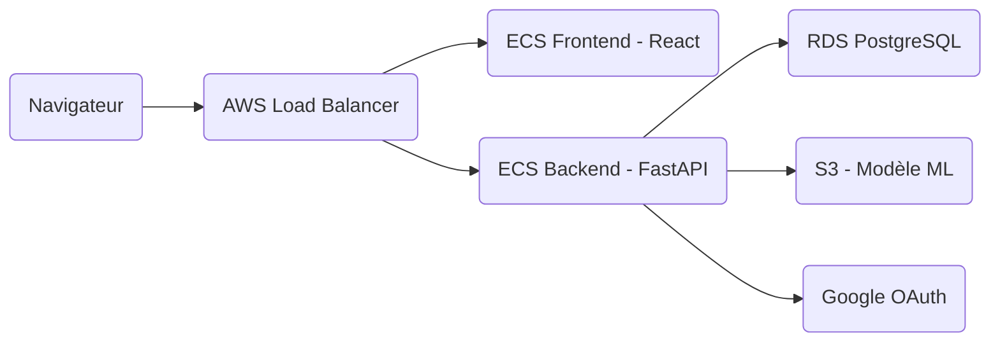

# MicroScore — Plateforme de Diagnostic Médical IA Natif Cloud

[](http://microscore-alb-875257365.eu-west-1.elb.amazonaws.com/)
[](https://opensource.org/licenses/MIT)

**MicroScore** est un système de diagnostic médical intelligent conçu pour assister les professionnels de santé dans l'identification rapide de maladies respiratoires et intestinales courantes. L'application combine un modèle d'IA performant avec une architecture cloud robuste et sécurisée sur AWS.

🔗 **Lien de l'application déployée** : [http://microscore-alb-875257365.eu-west-1.elb.amazonaws.com/](http://microscore-alb-875257365.eu-west-1.elb.amazonaws.com/)

---

## 🚀 Fonctionnalités Clés

### 🧠 Intelligence Artificielle & Diagnostic
- **Analyse des symptômes** : Évaluation de 17 symptômes clés pour générer des prédictions.
- **Classification multi-maladie** : Détection de 6 pathologies (Rhume, Grippe, COVID-19, Bronchite, Pneumonie, Gastro-entérite).
- **Score de confiance** : Chaque diagnostic est accompagné d'un indice de certitude issu du modèle ML.
- **Modèle performant** : Utilisation d'un `RandomForestClassifier` avec une précision de **99,2%**.

### 📊 Tableau de Bord Admin (Analytics)
- **KPIs Temps Réel** : Suivi du nombre total de diagnostics, confiance moyenne et tendances hebdomadaires.
- **Visualisation de données** : Graphiques dynamiques (Recharts) montrant la distribution des maladies et l'évolution quotidienne.
- **Historique complet** : Consultation détaillée de toutes les prédictions passées pour audit et analyse.

### 🔐 Sécurité & Performance
- **Authentification OAuth 2.0** : Connexion sécurisée via Google Auth.
- **Protection par Rate Limiting** : Limitation du débit (SlowAPI) pour prévenir le *model stealing* et les abus.
- **RBAC (Role-Based Access Control)** : Accès restreint aux fonctionnalités administratives.
- **Base de données persistante** : Stockage sécurisé sur PostgreSQL 16.

---

## 🛠️ Stack Technique

### Backend
- **Framework** : FastAPI (Python 3.11+)
- **ML & Data** : Scikit-learn, Joblib, Pandas
- **ORM & DB** : SQLAlchemy, Psycopg2, PostgreSQL 16
- **Sécurité** : PyJWT, Google Auth, SlowAPI
- **Cloud Integration** : Boto3 (AWS S3)

### Frontend
- **Framework** : React 18 (Vite)
- **Navigation** : React Router 6
- **Visualisation** : Recharts
- **Service** : Nginx (Conteneurisé)

### Infrastructure & DevOps
- **Cloud** : AWS (ALB, ECS Fargate, RDS, S3, ECR)
- **Conteneurisation** : Docker, Docker Compose
- **CI/CD** : GitHub Actions (Linting, Tests, Déploiement auto vers ECS)

---

## 🏗️ Architecture Cloud

Le projet propose deux stratégies de déploiement sur AWS, détaillées dans [`infra/aws/architecture.md`](infra/aws/architecture.md) :

1.  **Variante Production** : Sécurité maximale avec tâches ECS en sous-réseaux privés et NAT Gateway.
2.  **Variante Budget** : Optimisation des coûts (0$ NAT Gateway) en utilisant des sous-réseaux publics sécurisés par des Security Groups stricts.

### Schéma de flux


---

## 💻 Installation Locale

### Prérequis
- Docker & Docker Compose
- Compte Google Cloud (pour OAuth, optionnel en local)

### Lancement rapide
```bash
git clone <url-du-depot>
cd projet-cloud-s8
cp .env.example .env
docker compose up --build
```
- **Frontend** : [http://localhost:5173](http://localhost:5173)
- **Backend API** : [http://localhost:8000](http://localhost:8000)
- **Swagger Docs** : [http://localhost:8000/docs](http://localhost:8000/docs)

---

## 📂 Structure du Projet

```text
├── backend/            # API FastAPI & Logique ML
├── frontend/           # App React & Dashboard
├── infra/aws/          # Templates & Schémas d'architecture
├── scripts/            # Scripts d'entraînement et DevOps
├── docs/               # Documentation détaillée et rapports
├── .github/workflows/  # Pipelines CI/CD
└── docker-compose.yml  # Orchestration locale
```

---

## 📝 Documentation Additionnelle

- [Rapport de Projet Final](docs/livrable2/rapport-livrable2.md)
- [Analyse des Risques et Coûts](docs/livrable1/rapport-livrable1.md)
- [Spécifications du Modèle ML](docs/HEALTHCARE_MODEL.md)

---
**Développé dans le cadre du Master IA 2iE.**
